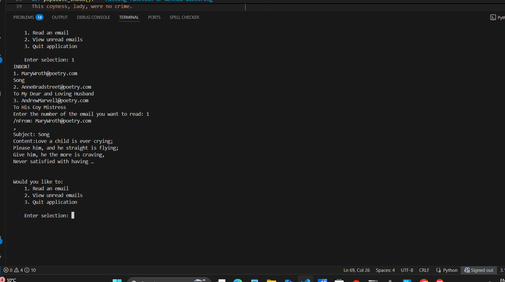

# 📧 OOP Email Simulator

This Python project simulates a basic command-line email application
using Object-Oriented Programming (OOP) principles.
It allows users to read emails, check unread emails, and quit the application
 — all through a simple menu system.

---

## 🚀 Features

- Create and manage email objects with attributes:
  - `email_address`
  - `subject_line`
  - `email_content`
  - `has_been_read`
- Mark emails as read once opened.
- View a list of all emails.
- View only unread emails.
- Exit upon request
---

## 🧱 How It Works

1. Emails are pre-populated for ease access.
2. The user interacts with a menu-driven interface to:
   - Read emails by selecting from a numbered list.
   - View only unread emails.
   - Exit the application.

---

## 🧠 Key Concepts

- **Object-Oriented Programming (OOP):** The `Email` class encapsulates email properties and behaviors.
- **Lists and Loops:** The inbox is a list of `Email` objects that are looped through for display and selection.
- **Conditionals & Input Handling:** User input drives the program's navigation, with input validation included.

---

## 📂 Project Structure

```
email.py
README.md
```

---

## ▶️ How to Run

1. Make sure you have Python 3 installed.
2. Clone/download the repository.
3. Run the script:

```bash
python email.py
```

4. Follow the prompts in the terminal.

---

## ✍️ Sample Data

Emails are written by classic poets like:
- Mary Wroth
- Anne Bradstreet
- Andrew Marvell

---

## 📌 To-Do (Optional Enhancements)

- Add functionality to send emails.
- Persist emails using file I/O or a database.
- Add email deletion and archiving features.
- Implement a login system for multiple users.

---

## 📜 License

This project is provided for educational purposes and is open for enhancement and reuse.


